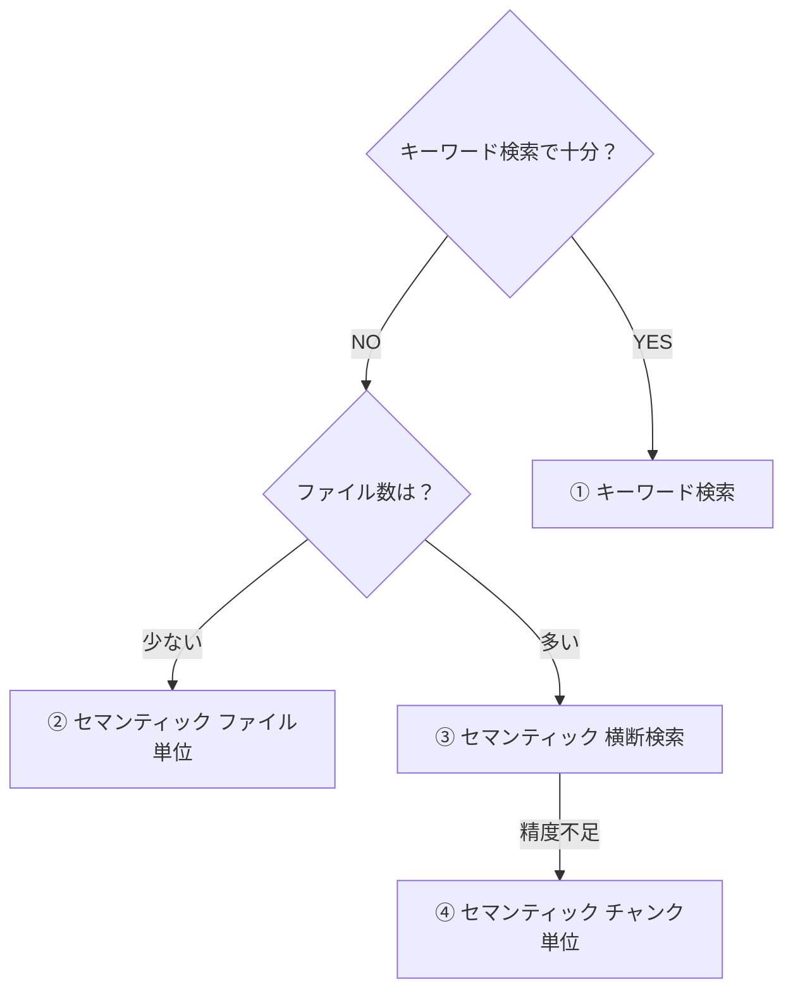

# スライドデザイン 詳細リファレンス

## NTTDテンプレート詳細

テンプレート: `C:\Users\KazuhideAkitake\Desktop\NTTDテンプレver1.2.pptx`

### スライドサイズ
- 幅: 13.333 inches (16:9)
- 高さ: 7.5 inches

### スライドマスター構成

| Master | 用途 | Layouts |
|--------|------|---------|
| Master 0 | 表紙系（濃紺背景） | イノベーションカーブ, イノベーションカーブ一部, イノベーションカーブなし, 写真 |
| Master 1 | 写真系 | 写真, イノベーションカーブ, 写真入イノベーションカーブ |
| Master 2 | **メインコンテンツ（白背景）** | タイトルのみ(0), タイトルと1コンテンツ(1), タイトルと２コンテンツ(2), タイトルと３コンテンツ(3), サブタイトル有(4), 白紙(5), 白紙（フッター有）(6), 全面画像(7), 右に画像(8), 左に画像(9), 下に画像(10), 画像3枚(11), 写真集(12), DEFAULT(13) |
| Master 3 | 中扉 | 白背景(0), 写真背景(1) |
| Master 4-7 | 上記の複製（色違い等） | - |

### スライドタイプ別レイアウト選択ガイド

| スライドの目的 | 推奨Master | 推奨Layout Index | Layout名 |
|---------------|------------|-----------------|----------|
| 表紙 | 0 | 0 | イノベーションカーブ |
| セクション区切り | 3 | 0 | 白背景 |
| 通常コンテンツ | 2 | 1 | タイトルと1コンテンツ |
| 2カラム比較 | 2 | 2 | タイトルと２コンテンツ |
| 3つの要素紹介 | 2 | 3 | タイトルと３コンテンツ |
| 自由レイアウト | 2 | 6 | 白紙（フッター有） |
| 画像メイン | 2 | 8 or 9 | 右に画像 / 左に画像 |

---

## 基本原則

### 1. テンプレート活用
- **スライドマスタを維持**: 既存テンプレートのレイアウト・マスタを使用
- **不要なシェイプ削除**: スライドマスタから継承された不要なテキストボックスは削除
- **レイアウト名確認**: 類似スライドのレイアウト名を確認して同じものを使用

### 2. フォント
- **フォント統一**: テンプレートのフォントに合わせる
  - 会社FMT: Noto Sans JP
  - 大京案件: BIZ UDPゴシック
- **フォント指定方法**: `font.name = "Noto Sans JP"` で明示的に指定
- **inheritは避ける**: デフォルト継承に頼らず、明示的にフォントを設定

### 3. カラーパレット
**カラフルにしすぎない。3色以内に抑える。**

**避けるべき**:
- オレンジ、グリーンなど多色使い
- 背景色付きの結論ボックス（シンプルなテキストで十分）

---

## 会社FMTテンプレート詳細

### テンプレートファイル
`~/.claude/skills/slide-design/templates/company_format.pptx`

### フォント詳細

| フォント名 | 用途 | 出現回数 |
|-----------|------|----------|
| Noto Sans JP | メインフォント（日本語） | 1413回 |
| Montserrat | 英語タイトル・見出し | 73回 |

### サイズ詳細

| サイズ | 用途 | 出現回数 |
|--------|------|----------|
| 10pt | 本文 | 708回 |
| 8pt | 補足・ページ番号 | 230回 |
| 12pt | 見出し | 81回 |
| 15pt | ページタイトル | 16回 |
| 24pt | セクションタイトル | 12回 |
| 11pt | 中間サイズ | 10回 |

### カラー詳細

| RGB | 用途 | 出現回数 |
|-----|------|----------|
| #0055FF | ブランドカラー（青1） | 16回 |
| #434343 | 通常テキスト | 11回 |
| #CC0000 | アクセント（赤） | 10回 |
| #FFFFFF | 白（背景・反転テキスト） | 10回 |
| #B7B7B7 | グレー1（補足） | 4回 |
| #000000 | 黒 | 2回 |

### スライドレイアウト

```
マスタ: 1個
レイアウト: 14種類

[0] TITLE              - 表紙用
[1] OBJECT             - 通常コンテンツ
[2] OBJECT_1           - コンテンツ変形
[3] OBJECT_1_1_3       - セクション区切り
[4] OBJECT_1_1_1       - セクション区切り
[5] CUSTOM             - カスタム
[6] CUSTOM_1           - カスタム
[7] PICTURE_WITH_CAPTION_TEXT_1     - 画像付き
[8] PICTURE_WITH_CAPTION_TEXT_1_2   - 画像付き
[9] OBJECT_1_1_1_1     - セクション区切り
[10] CUSTOM_2          - カスタム
[11] CUSTOM_1_1        - カスタム
[12] PICTURE_WITH_CAPTION_TEXT_1_3   - 画像付き
[13] PICTURE_WITH_CAPTION_TEXT_1_2_1 - 画像付き
```

---

## レイアウト構成（大京案件用）

### 2カラム構成の基本配置（単位: Inches）

```
[0.3, 0.55-0.6] タイトル (w=9.4)
[0.3, 0.85-0.9] リード文/結論 (w=9.4, 13pt Bold)
─────────────────────────────────────
[0.4, 1.35] 左セクションヘッダー  [4.8, 1.35] 右セクションヘッダー
[0.3, 1.65] 左コンテンツ          [4.9, 1.65] 右コンテンツ
   (チャート等)                       (テーブル等)
─────────────────────────────────────
[0.4, 4.2-4.3] 左下補足            [4.9, 4.3-4.4] 右下補足
[0.4, 4.9] フッター
```

### セクションヘッダー
- テキストに合わせてコンパクトな幅に（余白を取りすぎない）
- 12pt Bold、ダークブルー

---

## python-pptx実装時の注意

### フォント設定
```python
# 明示的にフォントを設定（会社FMT）
p.font.name = "Noto Sans JP"
p.font.size = Pt(10)
p.font.color.rgb = RGBColor(0x43, 0x43, 0x43)

# 大京案件
p.font.name = "BIZ UDPゴシック"
p.font.size = Pt(13)
p.font.bold = True
p.font.color.rgb = RGBColor(0x1F, 0x3A, 0x5F)
```

### テンプレートからスライド追加
```python
# 既存スライドのレイアウトを使用
template_slide = prs.slides[slide_index]
layout = template_slide.slide_layout
slide = prs.slides.add_slide(layout)

# スライドマスタから継承された不要なシェイプを削除
shapes_to_remove = []
for shape in slide.shapes:
    if shape.has_text_frame and "Google Shape" in shape.name:
        # プレースホルダーは必要に応じて削除
        shapes_to_remove.append(shape)
for shape in shapes_to_remove:
    sp = shape._element
    sp.getparent().remove(sp)
```

### チャートサイズ
- ドットチャートは縦につぶれやすいので**正方形に近い比率**を維持
- 例: `width=Inches(4.0), height=Inches(2.5)` 程度

### テーブル
- 列幅を明示的に設定
- ヘッダー行は Bold、ダークブルー
- データ行は Regular、グレー

---

## デザインパターンすり合わせのベストプラクティス

### パターン例

**パターンA: シンプル版**
- テキスト中心
- グラフ・テーブルは最小限
- 伝えたいメッセージを端的に

**パターンB: テーブル充実版**
- 詳細データをテーブルで提示
- 根拠を重視
- 分析結果の裏付けに

**パターンC: ハイライト重視版**
- 主要数値を大きく表示
- グラフで視覚的に訴求
- 結論ファーストで構成

### 提示フォーマット例

```
## パターン候補

### A. シンプル版
- 特徴: テキスト中心、メッセージ端的
- 配置: タイトル → 結論 → 補足テキスト
- 推奨ケース: 短時間で伝えたいとき

### B. テーブル充実版
- 特徴: 詳細データ重視
- 配置: タイトル → サマリー → 詳細テーブル
- 推奨ケース: 根拠を示したいとき

### C. ハイライト重視版
- 特徴: 主要数値を大きく、グラフ活用
- 配置: タイトル → 結論 → グラフ＋テーブル
- 推奨ケース: インパクトを出したいとき

どのパターンがよいですか？
```

---

## 経緯メモ

このSkillは以下の経験から作成:

1. **モックアップ3パターン作成**: シンプル重視 / テーブル付き / ハイライト重視
2. **パターンC採用**: ハイライト重視だがカラフルすぎ問題
3. **ユーザー修正で判明した課題**:
   - スライドマスタの不要テキストボックスが残っていた
   - フォントがinheritのままでテンプレートと不一致
   - リード文が太字になっていなかった
   - 色数が多すぎた

---

## 能動的確認プロセス【必須】

### 1. チャート・グラフ作成時の確認

「P○に合わせて」「このスライドと同じフォーマットで」等の指示があった場合、**実装前に参照元から以下を抽出して提示**すること：

```
参照元: P16 のチャート設定を抽出しました：

| 項目 | 値 |
|------|-----|
| チャートサイズ | width=4.00inch, height=2.78inch |
| マーカーサイズ | 10pt |
| X軸範囲 | 0-70 |
| Y軸範囲 | 0-100 |
| 凡例位置 | 下部 |

この設定で作成してよいですか？
```

**確認項目チェックリスト**:
- [ ] チャートサイズ（width × height）
- [ ] マーカーサイズ
- [ ] X軸の範囲（min-max）
- [ ] Y軸の範囲（min-max）
- [ ] 軸ラベルのフォントサイズ
- [ ] 凡例の位置
- [ ] 目盛線の有無
- [ ] マーカーの色（ベテラン/中堅・新人など）

### 2. 数値の整合性チェック

評価サマリー等で「平均」「合計」を表示する場合、**必ず検証**：

```python
# テーブルデータから計算
table_data = [4.2, 4.0, 4.2, 4.0]
calculated_avg = sum(table_data) / len(table_data)  # = 4.1

# 引き継ぎプロンプトの値
prompt_value = 4.0

# 不一致があれば報告
if calculated_avg != prompt_value:
    print(f"不一致検出: 計算値={calculated_avg}, プロンプト値={prompt_value}")
```

**不一致時の対応**:
```
数値の不一致を検出しました：

| 項目 | 引き継ぎプロンプト | テーブルから計算 |
|------|-------------------|-----------------|
| 全体平均 | 4.0 | 4.1 |
| ベテラン平均 | 3.8 | 3.9 |

どちらの値を使用しますか？
1. テーブルから計算した値（推奨）
2. 引き継ぎプロンプトの値
```

### 3. 星評価の対応ルール

| 数値範囲 | 星表示 |
|----------|--------|
| 4.5〜5.0 | ★★★★★ |
| 4.0〜4.4 | ★★★★☆ |
| 3.5〜3.9 | ★★★★☆ |
| 3.0〜3.4 | ★★★☆☆ |

### 4. テキストのレイアウト確認

複数行テキストがある場合：
- **改行で分かれている**: そのまま維持するか1行にまとめるか確認
- **文言追加の指示**: 挿入位置と正確な文言を確認

```
テキストの配置について確認：
現在: 「サマリー1行目」改行「サマリー2行目」
→ 1行にまとめますか？それとも2行のまま維持しますか？
```

---

## コンテンツ設計詳細

### テーブル設計のBefore/After例

**Before（悪い例）:**
```
| # | 検索方法 | 使用ツール | 事前準備 |
|---|---------|-----------|---------|
| ① | キーワード検索 | GCS API | 不要 |
| ② | セマンティック（ファイル単位） | GCS API + Gemini API | 不要 |
| ③ | セマンティック（横断検索） | Gemini API + Vertex AI Search | インデックス作成 |
```

問題点:
- 「使用ツール」列にテキストが羅列され、比較しにくい
- 技術用語（横断検索）が分かりにくい
- 「GCS API」は不正確な名称

**After（良い例）:**
```
| # | 検索方法 | ADKのtool | Gemini API | Vertex AI Search | RAG Engine |
|---|---------|-----------|------------|------------------|------------|
| ① | キーワード検索 | ○ | | | |
| ② | セマンティック検索（ファイル単位） | ○ | ○ | | |
| ③ | セマンティック検索（事前にインデックス化） | ○ | ○ | ○ | |
| ④ | セマンティック検索（事前にチャンク分け） | ○ | ○ | | ○ |
```

改善点:
- サービスごとに列を分けて○で表示 → 一目で比較可能
- 「事前にインデックス化」「事前にチャンク分け」→ 行動ベースで分かりやすい
- 正確なサービス名を使用

### テーブル設計ステップ

1. **何を比較したいか？（行）** を決める
2. **どの観点で比較するか？（列）** を決める
3. **セルは極力シンプルに** - ○×、数字、短い単語
4. **ラベルは読み手の言葉で** - 技術用語を避ける

### Mermaid図の生成方法

python-pptxでの複雑なシェイプ描画は崩れやすいため、Mermaidを使用する。

**1. Mermaidコード作成:**


**2. mermaid.ink APIでPNG生成:**
```python
import base64
import urllib.request

mermaid_code = "flowchart TD..."
encoded = base64.urlsafe_b64encode(mermaid_code.encode('utf-8')).decode('utf-8')
url = f"https://mermaid.ink/img/{encoded}?type=png&bgColor=white"

req = urllib.request.Request(url, headers={'User-Agent': 'Mozilla/5.0'})
with urllib.request.urlopen(req, timeout=30) as response:
    png_content = response.read()

with open('decision_flow.png', 'wb') as f:
    f.write(png_content)
```

**3. PowerPointに手動挿入:**
- 「挿入」→「画像」→ 生成したPNG/SVGを選択
- サイズ・位置を調整

### よくある失敗パターン

| 失敗 | 原因 | 対策 |
|------|------|------|
| テーブルの文字サイズがバラバラ | python-pptxのデフォルト継承 | runレベルでもfont設定 |
| シェイプで描いた図が崩れる | 位置計算の複雑さ | Mermaidで画像生成 |
| 不正確なAPI名 | 確認不足 | 正式名称を使用 |
| 技術用語で分かりにくい | 読み手視点の欠如 | 行動ベースのラベル |

---

## 今後の改善ポイント（TODO）

- [ ] テンプレートのカラーパレットを自動抽出する仕組み
- [ ] スライドマスタのシェイプ自動クリーンアップ
- [ ] フォント自動検出・統一スクリプト
- [ ] チャートサイズの最適比率の自動計算
- [ ] 複数テンプレート対応（プロジェクトごとのスタイル管理）
- [ ] プロジェクト別設定ファイル（JSON/YAML）の導入
- [ ] Mermaid図生成の自動化スクリプト
